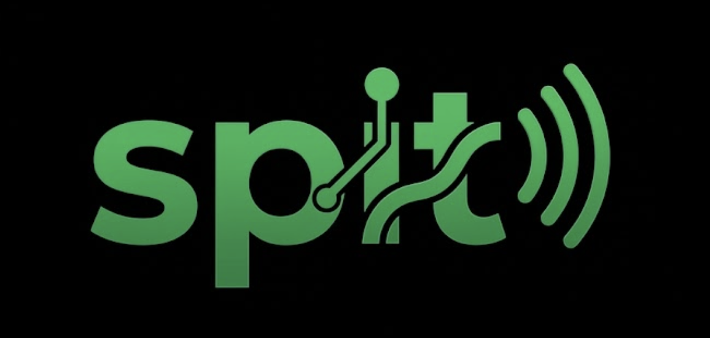

<p align="center">
  
</p>

<h1 align="center">spit</h1>

<p align="center">Git style version control for your Spotify playlists, right in the terminal.</p>

<p align="center">
  <a href="LICENSE"></a>
  
  
  
  
</p>

<!-- Optional: drop a terminal recording here and uncomment.
<p align="center"></p>
-->

spit treats a Spotify playlist like a git repository. You snapshot the playlist into a
local git repo, and from then on every ordinary git idea applies: commits, branches,
diffs, tags, merges, and history you can roll back. When you want to publish your local
edits back, one explicit command writes them to the real playlist.

The version control engine is the real `git` binary running under the hood, so the full
merge and rebase machinery is available, not a reimplementation.

## How it works

Think of Spotify as the remote and your local git repo as the checkout.

| git concept        | spit meaning                                                        |
| ------------------ | ------------------------------------------------------------------- |
| remote / origin    | the live Spotify playlist                                           |
| working tree       | `playlist.jsonl` (one track per line) plus `meta.json`              |
| `git fetch` / read | `spit init`, `spit pull`                                            |
| `git push`         | `spit push` (opt in, writes the playlist back)                      |
| a commit           | a snapshot of the track list at a point in time                     |

Track order is part of the versioned state. Because each track is its own line in
`playlist.jsonl`, a `git diff` reads naturally: added lines are added tracks, removed
lines are removed tracks, and a moved line is a reorder.

## Requirements

- Node.js 20 or newer
- The `git` binary on your `PATH`
- A Spotify account and a Spotify application (free to create)

## Install

Clone and build from source. The `prepare` step compiles TypeScript into `dist/` on install.

```bash
git clone https://github.com/RaffaelSh/spit.git
cd spit
npm install
```

Then either run it in place:

```bash
node dist/cli.js --help
```

or put `spit` on your `PATH`:

```bash
npm link       # now `spit` works anywhere
spit --help
```

## Spotify application setup

spit signs in with the OAuth Authorization Code flow with PKCE, so there is no client
secret to manage.

1. Create an app in the [Spotify developer dashboard](https://developer.spotify.com/dashboard).
2. Add `http://127.0.0.1:8888/callback` as a redirect URI (use `127.0.0.1`, not `localhost`).
3. Copy the app client id and hand it to spit once:

```bash
spit config set-client-id <your-app-client-id>
# or, per shell session:
export SPOTIFY_CLIENT_ID=<your-app-client-id>
```

The client id is stored in `~/.spit/config.json` (permissions `0600`) so token refresh
keeps working after your shell forgets the environment variable.

## Quick start

```bash
spit login                         # opens the browser once, caches a token in ~/.spit
spit init 37i9dQZF1DXcBWIGoYBM5M   # snapshot a playlist by id, URI, or open.spotify.com URL
cd "Today's Top Hits"              # spit created a git repo named after the playlist
spit log                           # the snapshot you just took
spit pull                          # re-read the live playlist into the working tree
spit diff                          # see what changed since the last snapshot
spit commit -m "evening edit"      # record a new revision
spit push --enable-writes          # publish local changes back to Spotify (asks first)
```

## Commands

| Command                          | What it does                                                            |
| -------------------------------- | ---------------------------------------------------------------------- |
| `spit login`                     | Authenticate with Spotify (PKCE) and cache a token in `~/.spit`.        |
| `spit config set-client-id <id>` | Persist your Spotify client id for login and refresh.                  |
| `spit config show`               | Show the resolved client id and where it comes from.                   |
| `spit init <playlistId> [dir]`   | Snapshot a playlist into a new spit (git) repo.                        |
| `spit commit -m <msg> [dir]`     | Re-snapshot the tracked playlist and record a revision if it changed.  |
| `spit pull [dir]`                | Re-read the live playlist into the working tree without committing.    |
| `spit status [dir]`              | Show the local snapshot and git state.                                 |
| `spit log [dir]`                 | Show the snapshot commit chain.                                        |
| `spit diff [dir] [rev1] [rev2]`  | Show added, removed, and moved tracks between two snapshots.           |
| `spit branch <name> [dir]`       | Create a branch pointing at the current snapshot.                     |
| `spit checkout <ref> [dir]`      | Restore an earlier snapshot into the working tree.                    |
| `spit merge <branch> [dir]`      | Merge a branch into the current snapshot (no auto resolve).           |
| `spit rebase <upstream> [dir]`   | Replay the current branch onto another ref.                           |
| `spit tag [name] [dir]`          | Tag the current snapshot, or list tags when no name is given.         |
| `spit stash [dir]`               | Shelve uncommitted snapshot edits.                                    |
| `spit stash pop [dir]`           | Restore the most recently stashed edits.                              |
| `spit revert <ref> [dir]`        | Undo a revision by creating its inverse commit (local only).          |
| `spit push [dir]`                | Write a committed snapshot back to the live playlist (opt in).        |

Every command takes an optional `[dir]` and defaults to the current directory.

## Write-back safety

Overwriting a real Spotify playlist is close to irreversible: Spotify has no undo and no
transactions. spit is careful about it on purpose.

- **Display only by default.** A fresh repo cannot write to Spotify. Reading, diffing,
  and local history never touch the remote.
- **Opt in per repo.** `spit push --enable-writes` flips a one time switch for that repo.
  Until you do, push refuses to run.
- **You see the blast radius first.** Before writing, push prints how many tracks will
  change, for example `This push will change 12 tracks: +3 added, -1 removed, ~8 moved`,
  and waits for a `y`. Pass `--yes` to skip the prompt in scripts.
- **Atomic replace.** The playlist is replaced in whole batches rather than edited in
  place, so an interrupted push does not leave a half applied state.

## Configuration and exit codes

- Token cache: `~/.spit/token.json` (`0600`), refreshed automatically before expiry.
- Client id: `SPOTIFY_CLIENT_ID` wins over `~/.spit/config.json`.
- Redirect URI: `http://127.0.0.1:8888/callback`.

Failures exit with a class specific code so scripts can branch on the kind of problem:

| Exit code | Meaning                                             |
| --------- | --------------------------------------------------- |
| `1`       | General failure                                     |
| `3`       | Not authenticated or session expired (`spit login`) |
| `4`       | Forbidden (missing scope, dev mode app, not owner)  |
| `5`       | Playlist not found or not visible                   |
| `6`       | Rate limited after retries                           |
| `7`       | Could not reach Spotify (network)                   |

## Development

```bash
npm run build          # compile to dist/
npm test               # build, then run the offline test suite
npm run dev -- --help  # run from TypeScript without building
```

The tests are fully offline. They never call the Spotify API and never touch your
account, so they are safe to run in a loop.

## License

[MIT](LICENSE) © Raffael Sheikh
